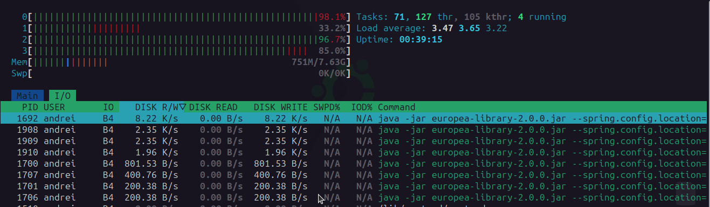

```
                            ⣿⣿⣿⣿⣿⣿⣿⣿⣿⣿⣿⣿⣿⣿⡿⢿⣿⣿⣿⣿⣿⣿⣿⣿⣿⣿⣿⣿⣿⣿
                            ⣿⣿⣿⣿⣿⣿⣿⣿⡿⠏⠻⣿⣿⣷⢀⡀⣾⣿⣿⠟⠙⢿⣿⣿⣿⣿⣿⣿⣿⣿
                            ⣿⣿⣿⣿⣿⣿⣿⣿⣿⣠⣄⣿⣿⣿⣿⣿⣿⣿⣿⣠⣄⣿⣿⣿⣿⣿⣿⣿⣿⣿
                            ⣿⣿⣿⣿⡿⠏⠻⢿⣿⣿⣿⣿⣿⣿⣿⣿⣿⣿⣿⣿⣿⣿⡿⠟⠹⢿⣿⣿⣿⣿
                            ⣿⣿⣿⣿⣟⣠⣄⣿⣿⣿⣿⣿⣿⣿⣿⣿⣿⣿⣿⣿⣿⣿⣿⣠⣄⣻⣿⣿⣿⣿
                            ⣿⣿⣿⣿⣿⣿⣿⣿⣿⣿⣿⣿⣿⣿⣿⣿⣿⣿⣿⣿⣿⣿⣿⣿⣿⣿⣿⣿⣿⣿
                            ⣿⣿⣿⡍⠀⢩⣿⣿⣿⣿⣿⣿⣿⣿⣿⣿⣿⣿⣿⣿⣿⣿⣿⣿⡍⠀⢩⣿⣿⣿
                            ⣿⣿⣿⣷⣶⣾⣿⣿⣿⣿⣿⣿⣿⣿⣿⣿⣿⣿⣿⣿⣿⣿⣿⣿⣷⣶⣾⣿⣿⣿
                            ⣿⣿⣿⣿⡿⠟⠿⣿⣿⣿⣿⣿⣿⣿⣿⣿⣿⣿⣿⣿⣿⣿⣿⠿⠻⢿⣿⣿⣿⣿
                            ⣿⣿⣿⣿⡷⣀⡀⣿⣿⣿⣿⣿⣿⣿⣿⣿⣿⣿⣿⣿⣿⣿⣿⢀⣀⢾⣿⣿⣿⣿
                            ⣿⣿⣿⣿⣿⣿⣿⣿⣿⠟⠻⣿⣿⣿⣿⣿⣿⣿⣿⠟⠻⣿⣿⣿⣿⣿⣿⣿⣿⣿
                            ⣿⣿⣿⣿⣿⣿⣿⣿⣷⣀⣀⣿⣿⣿⠋⠙⣿⣿⣿⣀⣀⣾⣿⣿⣿⣿⣿⣿⣿⣿
                            ⣿⣿⣿⣿⣿⣿⣿⣿⣿⣿⣿⣿⣿⣿⣴⣦⣿⣿⣿⣿⣿⣿⣿⣿⣿⣿⣿⣿⣿⣿
     ______                                     __    _ __
    / ____/_  ___________  ____  ___  ____ _   / /   (_) /_  _________ ________  __
   / __/ / / / / ___/ __ \/ __ \/ _ \/ __ `/  / /   / / __ \/ ___/ __ `/ ___/ / / /
  / /___/ /_/ / /  / /_/ / /_/ /  __/ /_/ /  / /___/ / /_/ / /  / /_/ / /  / /_/ /
 /_____/\__,_/_/   \____/ .___/\___/\__,_/  /_____/_/_.___/_/   \__,_/_/   \__, /
                       /_/                                                /____/
                                                                          SERVER
```

# Europea Library (server - Work In Progress)

A library web application that allows to index, retrieve information about books from file metadata/web (by using
multithreading) and search for ebooks. The front-end project can be
found [here](https://github.com/goto-eof/europea-library-client). While the Google Books API emulator can be
cloned from [here](https://github.com/goto-eof/europea-library-google-books-api-emulator/tree/master).

## Run the project

Before running the software as Spring Boot application it is necessary to follow some steps:

- edit the application.yml
    - set the `google.books.api_key` to your google api key
        - Europea Library uses Google Books API to retrieve information about books. This API has daily limits: 1,000
          requests/day. To get the API key go
          to [Google Console](https://console.cloud.google.com/apis/credentials?hl=it) and create an API key. Remember
          also to enable Google Books API. The indexer job runs once per day, so that if you have for example 3.000
          e-books, it will take about 3 days to retrieve all information about your library.
    - start the DBMS from the projects root directory with `sudo docker-compose up -d` command
    - run the project as Spring Boot application

## How the application works?

The core of the application is the indexer job. It retrieves all the information about files and saves them on the DB.
The indexing process consists of file metadata extraction and web metadata retrievement (in particular from Google Books
API). On the first run the job it will take some time to index and extract information from files or retrieve
them from web. This happens because the file metadata extraction and the web metadata retrievement is expensive in terms
of resources even if I implemented a **multithreading job**. The next job run will take less time, because the metadata
extraction was done for all the files (except the cases when the directory contains new e-books). After the job
completed all steps, the API becomes available for queries, so that the client application can interact with the API (
otherwise an HTTP 404 status is returned). Moreover, the indexer job starts every night at 11:00 PM (configurable). If
the job is already running then it will continue to process files and no other job will run.

## Job steps

Because the core of the application is the job indexer, I am attaching the job schema in which is explained in summary
how it works.


## Technologies

Java (JDK 21) • Spring Boot • Spring Batch • Spring JPA • Feign • Queryds • Hibernate • Liquibase • PostgreSQL
• Docker • epublib • pdfbox

## External services

Google Books API

## DB schema


## More

- Currently, I do not add new changesets to liquibase (the base schema is still in definition status), so that sometimes
  it is necessary to drop all tables and restart the application.
- During my tests (in debug mode) I noticed that the job, in order to index and extract metadata from 8.850 files in a
  single-thread context,
  takes about 1 hour on a notebook (based on Ubuntu) with Intel i5 (4 core, 2.40GHz) equipped with an SSD. Because I
  need to index about 100.000 ebooks, I decided to rewrite the job by implementing a multi-thread job processor. On the
  same notebook I ran
  the multi-thread job and the result is the following: about 30 minutes to index 8.850 files.
  
- developed and tested on Linux.
- if you have any suggestions or found a bug please contact me [here](https://andre-i.eu/#contactme)
