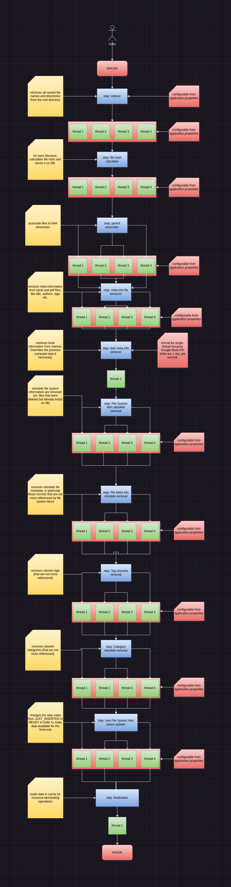
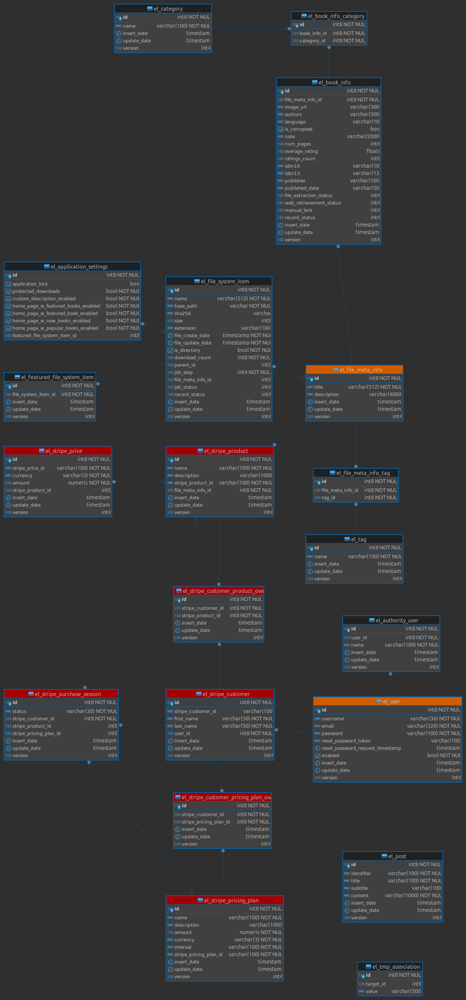
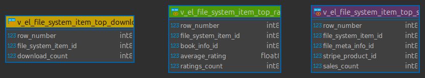

```
                            ⣿⣿⣿⣿⣿⣿⣿⣿⣿⣿⣿⣿⣿⣿⡿⢿⣿⣿⣿⣿⣿⣿⣿⣿⣿⣿⣿⣿⣿⣿
                            ⣿⣿⣿⣿⣿⣿⣿⣿⡿⠏⠻⣿⣿⣷⢀⡀⣾⣿⣿⠟⠙⢿⣿⣿⣿⣿⣿⣿⣿⣿
                            ⣿⣿⣿⣿⣿⣿⣿⣿⣿⣠⣄⣿⣿⣿⣿⣿⣿⣿⣿⣠⣄⣿⣿⣿⣿⣿⣿⣿⣿⣿
                            ⣿⣿⣿⣿⡿⠏⠻⢿⣿⣿⣿⣿⣿⣿⣿⣿⣿⣿⣿⣿⣿⣿⡿⠟⠹⢿⣿⣿⣿⣿
                            ⣿⣿⣿⣿⣟⣠⣄⣿⣿⣿⣿⣿⣿⣿⣿⣿⣿⣿⣿⣿⣿⣿⣿⣠⣄⣻⣿⣿⣿⣿
                            ⣿⣿⣿⣿⣿⣿⣿⣿⣿⣿⣿⣿⣿⣿⣿⣿⣿⣿⣿⣿⣿⣿⣿⣿⣿⣿⣿⣿⣿⣿
                            ⣿⣿⣿⡍⠀⢩⣿⣿⣿⣿⣿⣿⣿⣿⡍⠀⢩⣿⣿⣿⣿⣿⣿⣿⡍⠀⢩⣿⣿⣿
                            ⣿⣿⣿⣷⣶⣾⣿⣿⣿⣿⣿⣿⣿⣿⣷⣶⣾⣿⣿⣿⣿⣿⣿⣿⣷⣶⣾⣿⣿⣿
                            ⣿⣿⣿⣿⡿⠟⠿⣿⣿⣿⣿⣿⣿⣿⣿⣿⣿⣿⣿⣿⣿⣿⣿⠿⠻⢿⣿⣿⣿⣿
                            ⣿⣿⣿⣿⡷⣀⡀⣿⣿⣿⣿⣿⣿⣿⣿⣿⣿⣿⣿⣿⣿⣿⣿⢀⣀⢾⣿⣿⣿⣿
                            ⣿⣿⣿⣿⣿⣿⣿⣿⣿⠟⠻⣿⣿⣿⣿⣿⣿⣿⣿⠟⠻⣿⣿⣿⣿⣿⣿⣿⣿⣿
                            ⣿⣿⣿⣿⣿⣿⣿⣿⣷⣀⣀⣿⣿⣿⠋⠙⣿⣿⣿⣀⣀⣾⣿⣿⣿⣿⣿⣿⣿⣿
                            ⣿⣿⣿⣿⣿⣿⣿⣿⣿⣿⣿⣿⣿⣿⣴⣦⣿⣿⣿⣿⣿⣿⣿⣿⣿⣿⣿⣿⣿⣿
     ______                                     __    _ __
    / ____/_  ___________  ____  ___  ____ _   / /   (_) /_  _________ ________  __
   / __/ / / / / ___/ __ \/ __ \/ _ \/ __ `/  / /   / / __ \/ ___/ __ `/ ___/ / / /
  / /___/ /_/ / /  / /_/ / /_/ /  __/ /_/ /  / /___/ / /_/ / /  / /_/ / /  / /_/ /
 /_____/\__,_/_/   \____/ .___/\___/\__,_/  /_____/_/_.___/_/   \__,_/_/   \__, /
                       /_/                                                /____/
                                                                          SERVER
```

# Introduction

Because I have many e-books, one day, I get up and said "Why not create a web application that allows to
index, catalogue, search and provide e-book information?". In this way was born Europea Library :)

# What is Europea Library (server)

A library web application that allows to index, edit, explore, retrieve information about books from file metadata/web (
by using multi-threading), search, sell/buy through Stripe platform (WIP) and download e-books. The front-end project
can be found [here](https://github.com/goto-eof/europea-library-client).

# Demo

I already bought a domain and deployed the application on my VPS. So that I have
a working demo on [https://europea-library.eu](https://europea-library.eu). For now the Stripe payment features are set to
TEST MODE. It means that when you buy an e-book on europea-library.eu it is enough to use as test card like 424242...
and some random information in order to purchase the book.

# Development status

Take a look also to the [development progress status](https://github.com/users/goto-eof/projects/4).

## How the application works?

The core of the application is the indexer job. It retrieves all the information about files and saves them on the DB.
The indexing process consists of file metadata extraction and web metadata retrievement (in particular from Google Books
API). On the first run the job it will take some time to index and extract information from files or retrieve
them from web. This happens because the file metadata extraction and the web metadata retrievement is expensive in terms
of resources even if I implemented a **multithreading job**. The next job run will take less time, because the metadata
extraction was done for all the files (except the cases when the directory contains new e-books). After the job
completed all steps, the API becomes available for queries, so that the client application can interact with the API (
otherwise an HTTP 404 status is returned). Moreover, the indexer job starts every night at 00:00 PM (configurable). If
the job is already running then it will continue to process files and no other job will run.
After the job finished it's work, the e-book database is made available for exploration. In particular, the front-end
is able to list the files in different ways and orders, it allows also to filter the results or search for a e-book.
Moreover, it is also possible to view e-book information, update it, change the cover image and finally, download the
e-book. The file download is customizable, in particular, the administrator can choose if only authenticated users
should be able to download files or also not authenticated users have this right.
Currently, there are 3 categories of users: ADMINISTRATOR, USER and not authenticated user. ADMINISTRATOR is able to
customize the Home Page, to run the job and reload the application cache. While the user is able to download e-books (as
I said, this feature is customizable). All the users, authenticated and not authenticated, are able to explore the
library, search for an e-book and view book information.
Since version 9 (WIP), Europea Library became an e-book store (feature enableable by the administrator). Not
it is possible to sell and buy digital books through Stripe payment platform, so that it is possible to pay with
different banking circuits.

## Features

- index and catalog large digital books collection quickly;
- explore e-books by directory, top-rated, featured, top downloaded, just added, category, tags, file extension, language, publisher, published date, top sold;
- view book information;
- download e-books;
- search by title, author, publisher, ISBN and published date;
- edit e-book information, including change book cover image (only administrator is able to do this);
- generate e-book URL QR Code;
- login/change password/register to the system and change password (2 categories of user: ADMINISTRATOR and USER | XSS
  protection: JWT token + HttpOnly cookie | the TTL of the user session is 24 hours);
- password reset (reset link sent by e-mail)
- bulk category/tag/language/publisher name change (only administrator is able to do this);
- control panel (administration for admin, profile and security for all users)
    -  user management page, now the administrator is able to disable user accounts  
    - customize home page
        - enable/disable widgets
    - enable/disable protected downloads feature (only authenticated users or not authenticated are able to download
      e-books)
    - start/stop job
    - reload application cache
- sell/buy e-books and view transactions (Work In Progress)
- included actuator for application monitoring and management
- included Swagger UI for API documentation
- protection system against XSS attacks
- show/hide an e-book preventing access to potential buyers (but they are accessible by the owners and by the administrator)
- Google reCAPTCHA v.3 integration
- site cloning slowdown feature
  
## Run the project (test environment)

Before running the software as Spring Boot application it is necessary to follow some steps:

- edit the `application.yml` in the following way:
    - set the `com.andreidodu.europea-library.google.books.api_key` to your Google API key
        - Europea Library uses Google Books API to retrieve information about books. This API has daily limits: 1,000
          requests/day. To get the API key go
          to [Google Console](https://console.cloud.google.com/apis/credentials?hl=it) and create an API key. Remember
          also to enable Google Books API. The indexer job runs once per day, so that if you have for example 3.000
          e-books, it will take about 3 days to retrieve all information about your library.
    - edit the default `username`, `email` and `password` (at the first run the application will store these information
      on the db):
      ```
      default-admin-username: admin
      default-admin-email: admin@admin.com
      default-admin-password: password
      ```
    - edit the `qr-code-path` property in order to allow to generate QR Codes for each e-book;
    - generate certificates for encrypting and decrypting our JWT tokens in `src/main/resources/certs` by executing this
      set of commands:
        ```
        openssl genpkey -algorithm RSA -out private-key-old.pem && openssl rsa -pubout -in private-key-old.pem -out public-key.pem && openssl pkcs8 -topk8 -inform PEM -outform PEM -in private-key-old.pem -out private-key.pem -nocrypt &&   rm private-key-old.pem
        ```
        - Now you should have a `private-key.pem` and a `public-key.pem` file in `src/main/resources/certs`
    - start the DBMS from the projects root directory with `sudo docker-compose up -d` command or create from your
      PostgreSQL running instance a database named `europea_library`
    - run the project from your IDE
    - or execute the following command from the root of the project in order to create the jar file
      ```
      ./gradlew bootJar
      ```
    - then create a file called `start.sh`
      ```
      #!/bin/bash
      /bin/java -Dspring.config.location=application.yml -jar europea-library-X.X.X.jar
      ```
      where X.X.X is the application version
    - make it executable:
      ```
      chmod +x start.sh
      ```
    - run Europea Library jar
      ```
      ./start.sh
      ```

# Stripe payments

Test payments in your local environment (Stripe CLI).

```
stripe listen --forward-to localhost:8081/api/v1/stripe/webhook
```

# API documentation

The API documentation can be accessed here: http://localhost:8081/swagger-ui/index.html

## Job steps

Because the core of the application is the job indexer, I am attaching the job schema in which is explained in summary
how it works.


## DB schema - Tables



## DB schema - Views



## Technologies

Java • Spring Boot • Spring Batch • Spring Security • Spring Email Starter • Apache FreeMarker • Spring JPA • Queryds •
Hibernate • Feign • Liquibase • PostgreSQL • Swagger (OpenAPI) • Docker • epublib • pdfbox • Google ZXing • Google Books
API • Stripe • Apache FreeMarker

## More

- During my tests (in debug mode) I noticed that the job, in order to index and extract metadata from 8.850 files in a
  single-thread context,
  takes about 1 hour on a notebook (based on Ubuntu) with Intel i5 (2 core, 2.40GHz) equipped with an SSD. Because I
  need to index about 100.000 ebooks, I decided to rewrite the job by implementing a multi-thread job processor. On the
  same notebook I ran
  the multi-thread job and the result is the following: about ~2 minutes and 45 seconds to index 8.850 files. I also run
  the
  job on a set of about 110.000 ebook (~25.000 epub, ~25.000 pdf, ~60.000 other files, with some duplicate files), on
  i7-10750H (6 core, 2.60GHz)
  equipped with SSD, and it took 39 minutes to finish
  the job. Some steps were skipped (like FSI/FMI deleter) because I started the job on an empty database.
- developed and tested on Linux.
- if you have any suggestions or found a bug please contact
  me [here](https://andre-i.eu/#contactme)
